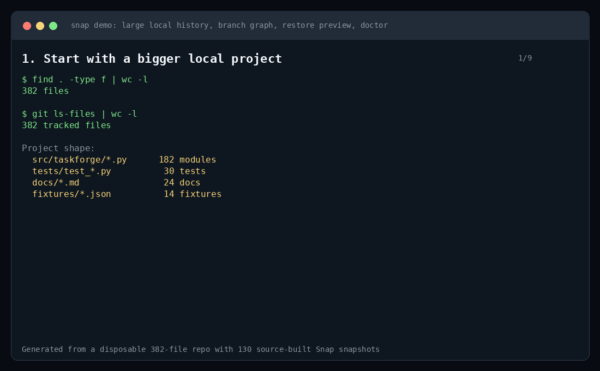

# Snap

[](https://github.com/Glooring/snap/actions/workflows/ci.yml)

Snap is a native Rust CLI for Git-powered local project checkpoints. It helps you create fast save points before risky refactors, AI-agent edits, experiments, or release work, and it gives beginners a safer alternative to copying entire project folders by hand.

> Git is the engine. Snap is the workflow.

Snap does not replace Git. It uses Git commits, annotated tags, and Snap metadata refs to provide a smaller, more guided workflow around local checkpoints, restore, diff, health checks, branch helpers, remote helpers, and release helpers.



This demo was generated from a disposable 382-file local Git repository with 130 source-built Snap snapshots. The [MP4 version](docs/assets/snap-demo.mp4) and [command transcript](docs/assets/snap-demo-transcript.txt) are available in `docs/assets/`.

## Why Snap Exists

Developers often need a quick "known good" point before doing something risky:

- asking an AI agent to edit several files;
- refactoring a subsystem;
- trying a dependency upgrade;
- preparing release artifacts;
- teaching a beginner how to stop making `project-backup-final-final` folders.

Git can already do all of this, but the workflow can be noisy when you only want a local safety point with clear labels, descriptions, restore, and health checks. Snap keeps Git underneath and gives the repeated workflow a direct command surface.

## Quick Workflows

### Before AI-agent edits or refactors

```bash
snap new before-agent-edit "before AI-assisted refactor"
# Run your editor, Codex, migration, or experiment.
snap new after-agent-edit "after AI-assisted refactor"
snap diff before-agent-edit after-agent-edit
snap doctor --json --ci
```

If the result is wrong, restore the earlier checkpoint:

```bash
snap restore before-agent-edit --dry-run
snap restore before-agent-edit
```

### For beginners

```bash
snap init
snap new first-working-version "it runs"
snap list
snap restore first-working-version
```

Snap is meant to be a bridge into Git-powered history, not a way to avoid learning Git forever.

### Daily Git workflow helpers

```bash
snap status
snap save "small normal Git commit"
snap sync
snap history
snap branch list
```

To understand which snapshots belong to which local branches:

```bash
snap list --all-branches
snap list --branch main
snap history --all-branches
```

### Health checks

```bash
snap doctor
```

`snap doctor` is read-only by default. It checks Git repository health, snapshot tags, and Snap metadata refs, then reports whether the repository looks healthy.

## Command Surface

The current source-built CLI exposes these command groups:

| Area | Commands |
| --- | --- |
| Snapshots | `init`, `new`, `list`, `diff`, `restore`, `delete`, `edit`, `update` |
| Daily Git workflow | `status`, `save`, `push`, `pull`, `sync`, `history`, `update-repo` |
| Branches | `branch list`, `branch new`, `branch switch`, `branch delete`, `branch merge` |
| GitHub/remotes | `remote`, `setup-repo`, `make-public`, `make-private`, `delete-repo` |
| Release helpers | `release windows`, `release linux`, `release macos`, `release all`, `release upload`, `release list` |
| Diagnostics/config | `doctor`, `options`, `examples` |

Run `snap --help` or `snap <command> --help` for the exact CLI contract of the binary you are using.

## How Snap Stores Checkpoints

Snap stores data inside the project Git repository:

- project files are stored as normal Git commits;
- snapshot labels are annotated Git tags;
- snapshot descriptions live in tag messages;
- new snapshot tag messages include `Snap-Snapshot: true`;
- empty-directory, hidden-file, and read-only metadata is serialized as Git blobs;
- metadata blobs are pinned under `refs/snap-metadata/<hash>` so Git garbage collection keeps them reachable.

This keeps the working directory clean and makes snapshots portable across Windows, Linux, and WSL2. It also means Snap snapshots are currently visible as Git tags. Snap filters snapshot views to marked tags, metadata-bearing tags, and legacy Snap-style tags, so ordinary release tags are not listed as Snap snapshots. Until a future namespace migration is designed, avoid using release-looking snapshot labels such as `v1.0` for routine checkpoints.

## Safety Model

Snap is designed around explicit local operations:

- `snap doctor` is read-only unless you pass `--repair`.
- `snap doctor --json` prints machine-readable health output.
- `snap doctor --ci` exits non-zero when warnings or errors are found.
- `snap doctor --repair` creates a `.git.backup.YYYYMMDD-HHMMSS` backup and asks before changing anything.
- `snap restore --dry-run` previews restore impact without changing files or tags.
- `snap restore` creates a rescue snapshot first when the current state is dirty or otherwise unprotected.
- `snap restore --no-rescue` keeps the explicit discard-confirmation path.
- `snap delete` removes a snapshot tag only after confirmation.
- `snap delete --purge` is the disk-reclaiming path. It pins remaining metadata, creates a targeted bundle backup by default, asks for stronger confirmation, and then runs Git cleanup.

Remaining roadmap work includes a future namespaced snapshot-ref migration decision, checksum automation, and a possible alternate Linux binary-name decision.

## Known Limitations

- Snap is local-first. It is not a cloud backup service.
- Snap uses Git. If Git is missing or the repository is badly corrupted, run `snap doctor` first and follow the repair guidance.
- Snapshot labels are currently Git tags. Snap now marks new snapshot tags and filters ordinary release tags out of snapshot views, but a future namespaced ref model is still undecided.
- On many Linux systems, `snap` may already be Canonical Snapcraft. Check your PATH before installing this binary as `snap`.
- Cross-platform CI, core OSS maintainer files, and packaging/name-conflict docs are present; checksum automation and an alternate Linux binary-name decision remain planned.
- Strict Clippy with `-D warnings` is expected to pass after the Sprint 4 cleanup.

## Why Not Just Git?

Use Git directly when you want full version-control control. Use Snap when you want a focused workflow for local checkpoints:

- human labels and descriptions for restore points;
- a compact `snap list`, including branch-aware views with `snap list --all-branches`;
- `snap diff` between checkpoints;
- a readable Git graph with snapshot tags through `snap history --all-branches`;
- metadata handling for empty directories and hidden/read-only attributes;
- `snap doctor` for Git and Snap metadata health;
- friendlier commands for common branch, remote, and release tasks.

Snap should make Git less intimidating, not invisible.

## Why CLI-First?

Snap is built for repeated developer workflows. A CLI works well in terminals, editors, scripts, CI, WSL2, and AI-agent sessions. It is easy to run before and after a risky operation, and it keeps the workflow inspectable through plain Git and plain text output.

## Prerequisites

- Git must be installed and available on PATH.
- Windows 10 or later, a modern Linux distribution, macOS, or WSL2.
- Rust is required only if you build from source.

## Installation

See [Installation and release assets](doc/INSTALLATION.md) for Windows, Linux, macOS, and WSL2 install paths, release asset names, checksum expectations, and binary verification.

On Linux, be careful with the command name. `snap` may already refer to Canonical Snapcraft. Do not overwrite an existing system command unless you intentionally choose that installation strategy.

## Build From Source

```bash
git clone https://github.com/Glooring/snap.git
cd snap
cargo build --release
./target/release/snap --help
./target/release/snap doctor
```

During this repository's OSS-readiness refactor, source behavior is validated with source-built Snap (`cargo run -- ...`, `./target/debug/snap ...`, or `./target/release/snap ...`). The maintainer's globally installed `snap` binary is intentionally older and used only for local refactor checkpoints.

## Public Docs

- [Installation and release assets](doc/INSTALLATION.md)
- [AI-agent workflow](doc/AI_AGENT_WORKFLOW.md)
- [Codex workflow](doc/CODEX_WORKFLOW.md)
- [Codex task recipes](doc/CODEX_TASKS.md)
- [Beginner workflow](doc/BEGINNER_WORKFLOW.md)
- [Beginner demo fixture](doc/demo-fixture/README.md)
- [Why not just Git](doc/WHY_NOT_GIT.md)
- [Safety model](doc/SAFETY_MODEL.md)
- [Snap doctor](doc/SNAP_DOCTOR.md)
- [Known limitations](doc/KNOWN_LIMITATIONS.md)
- [Performance methodology](doc/PERFORMANCE.md)
- [Cross-platform notes](doc/CROSS_PLATFORM.md)
- [Community feedback readiness](doc/COMMUNITY_FEEDBACK.md)
- [OpenAI application package](doc/OPENAI_APPLICATION_PACKAGE.md)

Existing deeper technical notes:

- [Friendly Git workflow implementation](doc/FRIENDLY_GIT_WORKFLOW_IMPLEMENTED.md)
- [Git health stabilization](doc/GIT_HEALTH_STABILIZATION.md)
- [Repair Git errors](doc/REPAIR_GIT_ERRORS.md)
- [Snapshot purge and metadata GC retrospective](doc/SNAPSHOT_PURGE_AND_METADATA_GC_RETROSPECTIVE.md)
- [Windows and WSL installer build notes](doc/BUILD_INSTALLERS_WINDOWS_WSL.md)

Community and maintainer docs:

- [Contributing](CONTRIBUTING.md)
- [Security policy](SECURITY.md)
- [Support](SUPPORT.md)
- [Changelog](CHANGELOG.md)
- [Code of conduct](CODE_OF_CONDUCT.md)
- [Agent instructions](AGENTS.md)

## Troubleshooting

- `Git is not installed or not in your system PATH`: install Git and open a new terminal.
- `Not a snap repository`: run `snap init` in the project first.
- `Git repository has empty object/ref files`: run `snap doctor`, then `snap doctor --repair` if the repair plan looks correct.
- `Git HEAD is detached`: run `snap doctor`; repair mode can normalize safe cases.
- `Snapshot metadata blob ... could not read it`: run `snap doctor`; active metadata may be regenerated by repair mode, while historical metadata loss must be accepted explicitly with `snap doctor --repair --accept-metadata-loss`.
- Unsure what restore will do: run `snap restore <id> --dry-run`; normal restore creates a rescue snapshot first when needed.
- Need to reclaim disk space after a bad snapshot: plain `snap delete` removes the tag only. Use `snap delete <id> --purge` for Git object cleanup.

## Contributing

See [CONTRIBUTING.md](CONTRIBUTING.md) for the full contribution guide. Keep changes scoped, run the local gates, and be especially careful around restore, delete, doctor, Git health, metadata, command execution, and path handling.

Recommended local checks:

```bash
git diff --check
cargo fmt --check
cargo clippy --all-targets --all-features
cargo test
cargo build --release
./target/release/snap doctor
```

## License

Snap is MIT licensed. See [LICENSE](LICENSE).
